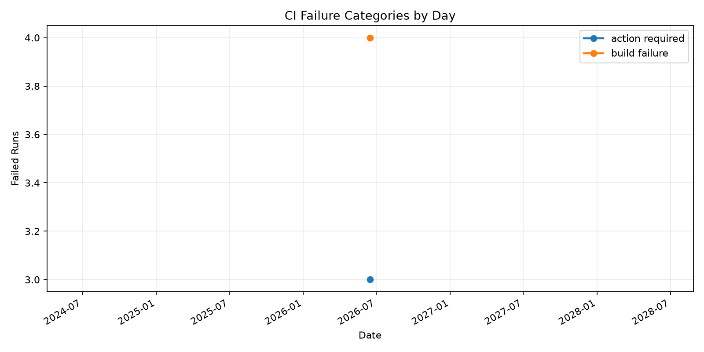
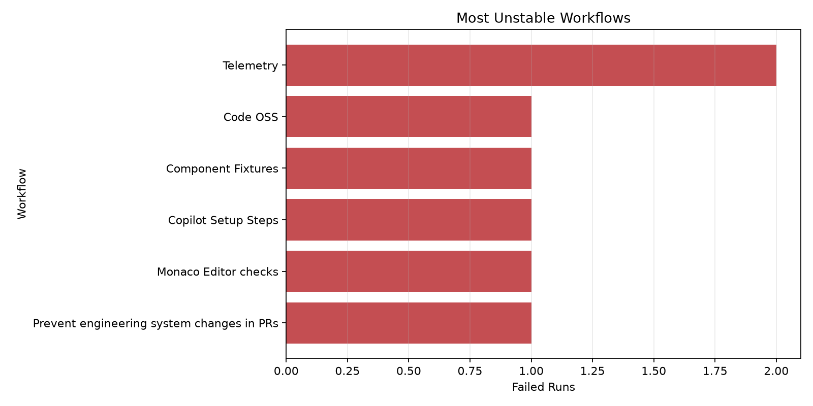

# GitHub Efficiency Analyzer

A Python project for engineering productivity analysis.

This tool analyzes two signals that engineering teams care about:
- pull request collaboration efficiency
- GitHub Actions stability and CI failure patterns

It pulls GitHub repository data, classifies workflow failures from logs and metadata,
and generates reports that are easier to use in weekly updates, internal reviews, or portfolio demos.

## Demo output

### CI failure trend



### Most unstable workflows



## Sample result

Real run against `microsoft/vscode`:
- 9 PRs inspected
- 1 merged PR
- average merge time: 9.65 hours
- 17 completed workflow runs
- workflow success rate: 17.65%
- dominant failure type: `build_failure`
- most unstable workflow: `Telemetry`

## What makes this useful

- combines PR efficiency analysis and CI stability analysis in one workflow
- classifies CI failures from logs instead of only counting pass/fail states
- generates weekly-style digest output instead of raw metrics only
- validated on a real public repository, not just mocked sample data

## Why this project

Engineering efficiency work is often described at a high level, but teams still need concrete answers to questions like:
- How long do PRs take to merge?
- Which workflows fail the most?
- Are failures concentrated in tests, builds, dependencies, or infrastructure?
- What should a weekly CI summary say without manual cleanup?

This project turns those questions into a reproducible Python CLI workflow.

## What it does

- Pulls recent PR data from a target GitHub repository
- Computes PR metrics such as merge time, change size, comment volume, and active authors
- Pulls GitHub Actions workflow run data
- Classifies CI failures with a log-first approach and metadata fallback
- Generates CSV, Markdown, and PNG outputs for reporting
- Produces a weekly-style CI digest with risk statements and suggested actions

## Core features

### PR analytics
- total PR count
- merged vs open PRs
- average and median merge time
- average PR size and changed files
- top active authors

### CI analytics
- completed workflow run count
- failed workflow run count
- workflow success rate
- most unstable workflows
- failure type distribution

### Failure classification
- test failure
- lint failure
- build failure
- dependency failure
- infrastructure failure
- permission failure
- resource failure
- timeout
- unknown failure

Classification uses GitHub Actions logs first. If logs are unavailable, the tool falls back to workflow job and step metadata.

## Generated outputs

- `outputs/pull_requests.csv`: pull request detail rows
- `outputs/workflow_runs.csv`: workflow run detail rows
- `outputs/summary.md`: combined PR and CI summary
- `outputs/weekly_digest.md`: weekly-style CI digest
- `outputs/ci_failure_trend.png`: daily CI failure trend chart
- `outputs/unstable_workflows.png`: most unstable workflow chart

## Real sample run

Repository analyzed:
- `microsoft/vscode`

Command:

```powershell
python -m app.main --repo microsoft/vscode --days 14 --limit 20
```

Sample findings from a real run:
- 9 PRs inspected
- 1 merged PR
- average merge time: 9.65 hours
- 17 completed workflow runs
- workflow success rate: 17.65%
- dominant failure type: `build_failure`
- most unstable workflow: `Telemetry`

This matters because it shows the project is not only scaffolded code. It has already been run against a real public repository and produces interpretable output.

## Project structure

```text
github-efficiency-analyzer/
  app/
    charts.py
    ci_failure_analysis.py
    config.py
    github_client.py
    main.py
    metrics.py
    models.py
    report.py
  tests/
    test_metrics.py
  .env.example
  .gitignore
  requirements.txt
  README.md
```

## Tech stack

- Python 3.11
- requests
- python-dotenv
- pandas
- matplotlib
- pytest

## Quick start

```powershell
python -m venv .venv
.venv\Scripts\Activate.ps1
pip install -r requirements.txt
Copy-Item .env.example .env
```

Add your GitHub token to `.env`:

```env
GITHUB_TOKEN=your_token_here
```

Run the analyzer:

```powershell
python -m app.main --repo microsoft/vscode --days 30 --limit 50
```

## Example use cases

- engineering weekly report generation
- CI stability analysis for a repository
- PR efficiency trend review
- internal tooling practice for an engineering productivity role
- portfolio demo for Python, APIs, and analytics-oriented backend work

## Engineering highlights

- modular Python package structure
- CLI-driven workflow
- graceful handling for missing chart dependencies
- log-driven CI failure classification
- local report generation without external services
- test coverage for core metric logic

## Future improvements

- first review response time
- author or team level grouping
- richer failure pattern coverage
- HTML dashboard
- Google Sheets or Docs export
- scheduled reporting

## Resume-ready project description

Built a Python-based GitHub engineering efficiency analyzer that collects pull request and GitHub Actions workflow data, classifies CI failures from logs, and generates CSV, Markdown, and chart-based reports for weekly engineering productivity review. Implemented PR merge-time metrics, workflow stability analysis, failure categorization, and automated digest generation, then validated the tool on a real public repository.
