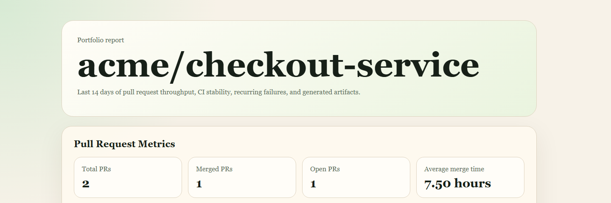

# GitHub Efficiency Analyzer

> Turn GitHub pull request and Actions data into explainable engineering-efficiency insights.

[Live report](https://darrk-star.github.io/github-efficiency-analyzer/) | [Offline demo](#offline-portfolio-demo) | [Run tests](#quality-checks)



## What This Demonstrates

- Resilient GitHub REST API integration with pagination, bounded retries, rate-limit handling, and typed payload translation.
- Explainable CI diagnosis using deterministic classification, evidence extraction, and stable failure fingerprints.
- Snapshot-based trend comparison that identifies `new`, `persistent`, `regressed`, `resolved`, and `suspected_flaky` issues.
- Reproducible CSV, Markdown, PNG, JSON, and static HTML reporting with automated tests and GitHub Pages deployment.

This is a focused portfolio project for Python backend and engineering productivity roles. It is designed to be easy to run, inspect, test, and discuss in an interview.

## Why This Project

Engineering teams often need answers that are more specific than a raw GitHub activity feed:

- How long do pull requests take to merge?
- Which workflows fail repeatedly?
- Are failures caused by tests, builds, dependencies, permissions, or infrastructure?
- Did a CI failure appear for the first time, regress, persist, or get resolved?
- Can a weekly report explain what deserves attention next?

The analyzer combines pull request metrics with GitHub Actions stability analysis and produces CSV, Markdown, PNG chart, and compact JSON snapshot outputs from one reproducible CLI command.

## Architecture

```text
GitHub REST API
  -> resilient collection and pagination
  -> typed PR/workflow records
  -> deterministic failure classification and fingerprinting
  -> pure metric, snapshot, and trend comparison modules
  -> CSV, Markdown, PNG, and compact JSON outputs
```

| Module | Responsibility |
| --- | --- |
| `app/github_client.py` | GitHub HTTP calls, pagination, retries, rate-limit errors, and payload translation |
| `app/models.py` | Immutable domain records and shared workflow outcome semantics |
| `app/ci_failure_analysis.py` | Explainable rule-based log classification and evidence extraction |
| `app/failure_fingerprint.py` | Stable SHA-256 fingerprints from noise-normalized CI failure details |
| `app/snapshots.py` | Compact JSON snapshot persistence for week-over-week comparison |
| `app/trends.py` | Pure snapshot comparison: lifecycle statuses and suspected flaky detection |
| `app/metrics.py` | Pure PR/CI aggregation, trends, weekly digest, snapshot issues, and CSV rows |
| `app/report.py` | Markdown report rendering |
| `app/charts.py` | Optional PNG charts from already-computed rows |
| `app/main.py` | CLI validation, orchestration, output paths, and exit codes |

## Engineering Decisions

### Correct pagination

GitHub pull requests are returned sorted by `updated_at`, while this project defines its reporting window by `created_at`. The collector therefore filters matching PRs without stopping at the first old record. This avoids silently omitting a recently created PR that appears after an old PR updated recently.

Workflow runs are returned newest first by creation time, so workflow collection can stop safely at the first run outside the requested window.

### Fewer expensive requests

Successful, neutral, skipped, and cancelled workflow runs do not need diagnostic logs. Jobs and log archives are fetched only for unsuccessful runs that need classification. This keeps the normal path cheaper and makes the trade-off visible in tests.

### Explicit outcome semantics

Workflow conclusions are grouped consistently across summaries, trends, charts, snapshots, and weekly digests:

- `success`: successful
- `failure`, `timed_out`, `action_required`, and other unsuccessful conclusions: failed
- `cancelled`: cancelled and reported separately
- `neutral`, `skipped`, `stale`, and missing conclusions: excluded from the success-rate denominator

The success rate is:

```text
successful / (successful + failed) * 100
```

### Explainable failure diagnosis

Failure classification is deterministic and rule-based. Each classification retains a concise evidence line and a source such as `logs`, `job_metadata`, `conclusion`, or `fallback`. A generic `exit code 1` is not treated as a test failure without stronger evidence. Unknown failures remain visible instead of being presented as confidently classified.

### Failure fingerprints

Repeated CI failures often contain volatile tokens such as timestamps, UUIDs, absolute file paths, line numbers, and high-cardinality numeric IDs. Normalizing these tokens before hashing ensures equivalent failures produce the same fingerprint. The hash input combines `category + normalized_detail`, so a test failure and a build failure with the same surface-level message produce different fingerprints.

Each fingerprint has the stable identifier format `ci-failure-<12 hex chars>` and is deterministic across machines and operating systems.

### Adjacent-window snapshots

The latest snapshot uses a filename derived from `repo__days__end-date.json`. The adjacent equal-window snapshot is located by subtracting `days` from the current end date. Re-running on the same date never treats the just-written snapshot as the previous period, and a missing baseline is a normal first-run condition, not an error.

### Lifecycle statuses

A pure comparison of two adjacent snapshots yields one of four statuses for each recurring fingerprint:

- `new`: appeared in the current window but not the previous one.
- `persistent`: present in both windows with equal or lower count.
- `regressed`: present in both windows with a higher count.
- `resolved`: present only in the previous window.

Active issues (`regressed`, `new`, `persistent`) are sorted before `resolved` issues and by decreasing count.

### Suspected flaky detection

A fingerprint is marked `suspected_flaky` when the same workflow contains a `failure(fp_X) -> success -> failure(fp_X)` subsequence across the combined snapshot observation set. This heuristic catches repeat offenders without requiring every run to be inspected manually. Consecutive failures and different fingerprints around a success are ignored.

## Metrics

### Pull requests

- Total, merged, and open PR counts
- Average and median merge time: `merged_at - created_at`
- Average PR size: additions plus deletions
- Average changed files
- Average comment volume: issue comments plus review comments
- Top authors by PR count

The PR time window is based on PR creation time. Requested reviewers are exported for context, but they are not presented as historical reviewer participation because the GitHub field does not reliably represent completed reviews.

### GitHub Actions

- Total completed runs
- Successful, failed, cancelled, and excluded run counts
- Success rate using only successful and failed runs
- Average workflow duration
- Failure category distribution
- Most frequently failing workflows
- Daily failure trend and weekly digest
- Compact issue clusters and observations for trend snapshots

## Outputs

The command writes these files under `outputs/` by default:

- `index.html` - the best single artifact to open during a portfolio review
- `pull_requests.csv`
- `workflow_runs.csv`
- `summary.md`
- `weekly_digest.md`
- `ci_failure_trend.png`
- `unstable_workflows.png`

It also writes compact trend snapshots under `outputs/snapshots/` by default:

- `owner__repo__14__2026-07-20.json`

Snapshots do not persist full logs or tokens.

## Quick Start

```powershell
python -m venv .venv
.venv\Scripts\Activate.ps1
pip install -r requirements-dev.txt
Copy-Item .env.example .env
```

Add a GitHub token to `.env`:

```env
GITHUB_TOKEN=ghp_your_token_here
```

Run an analysis:

```powershell
python -m app.main --repo microsoft/vscode --days 14 --limit 20
```

Use a custom snapshot directory when demonstrating failure trends:

```powershell
python -m app.main --repo microsoft/vscode --days 14 --limit 20 --snapshot-dir outputs/snapshots
```

The CLI validates `owner/name`, positive `--days`, and positive `--limit` before making network calls. GitHub authentication, not-found, rate-limit, timeout, and retry exhaustion errors return a non-zero exit code with an actionable message.

## Offline Portfolio Demo

Run the no-token portfolio demo when you want to show the project quickly without GitHub credentials or network access:

```powershell
python -m app.main --demo --output-dir outputs/demo --snapshot-dir outputs/demo/snapshots
Start-Process outputs/demo/index.html
Get-Content outputs/demo/weekly_digest.md
Get-Content outputs/demo/snapshots/*.json
```

The demo writes `outputs/demo/index.html`, which is the recommended first file to open when showing the project without GitHub credentials.

## Quality Checks

The same checks run locally and in `.github/workflows/ci.yml`:

```powershell
python -m pytest -q
python -m compileall -q app tests
python -m app.main --help
python -m ruff check .
python -m ruff format --check .
python -m mypy app
```

The current branch has 64 passing tests covering the core analyzer, failure trends, offline demo, HTML reporting, and deployment workflow contract.

HTTP tests use deterministic fake sessions and multi-page fixtures. They do not depend on a live GitHub repository or token.

Ruff and mypy configuration is committed and runs in GitHub Actions. In the development environment used for this iteration, package installation for those tools was blocked by the machine's pip/index configuration, so their first authoritative run is expected to come from GitHub Actions.

## Sample Output

The repository includes chart assets and a historical sample run against `microsoft/vscode` for demonstration. Sample values are illustrative and are not guaranteed to match current repository activity.

Example command:

```powershell
python -m app.main --repo microsoft/vscode --days 14 --limit 20
```

Example findings from the historical sample:

- 9 PRs inspected
- 1 merged PR
- Average merge time: 9.65 hours
- 17 completed workflow runs
- Workflow success rate: 17.65%
- Dominant failure type: `build_failure`

## Failure Trend Demo

```powershell
python -m app.main --repo owner/repo --days 14 --limit 20 --snapshot-dir outputs/snapshots
# Run again after the next adjacent 14-day window to compare against the prior snapshot:
python -m app.main --repo owner/repo --days 14 --limit 20 --snapshot-dir outputs/snapshots
Get-Content outputs/snapshots/owner__repo__14__*.json
```


A live result still requires a GitHub token and repository access. The repository does not claim a fixed live demo output because GitHub activity changes over time.

## Limitations and Roadmap

This project intentionally does not include a web dashboard, database, scheduled jobs, organization-wide aggregation, or LLM-based classification. It also does not calculate historical first-review response time because that requires review-event history rather than the current requested-reviewers snapshot.

v2 addresses the v1 gap where a single pass over CI runs could not distinguish recurring failures from isolated ones. Current limitations:

- `suspected_flaky` is a heuristic using a single fail-success-fail pattern and does not track actual GitHub re-run or workflow dispatch events.
- Snapshot comparison works between two adjacent equal-window snapshots, not a rolling multi-window view.
- Full logs are never persisted with the snapshot; only the compact fingerprint, categorization, and occurrence count are saved.
- The CLI does not expose a standalone dashboard or notification system for regressions.

Useful next steps would be:

1. Add multi-window rolling detection and confidence scoring.
2. Add workflow ownership and notification integrations.
3. Add review-event metrics after introducing the required API collection.

## Interview Talking Points

### v1

- I found and fixed a pagination correctness issue caused by GitHub sorting PRs by update time while the report window uses creation time.
- I reduced unnecessary GitHub API work by skipping jobs and log downloads for successful runs.
- I made workflow success-rate semantics explicit instead of mixing cancelled and excluded runs into failures.
- I added bounded retries and user-facing rate-limit/authentication errors around the HTTP client.
- I used deterministic HTTP fixtures so correctness tests do not depend on live network state.
- I kept failure diagnosis rule-based and explainable rather than claiming opaque classifier accuracy.

### v2 - failure trend snapshots

- I built a deterministic failure fingerprint system that normalizes timestamps, UUIDs, absolute paths, line numbers, and large numeric IDs before SHA-256 hashing, so repeated incidents with different volatile tokens produce the same fingerprint.
- I designed a compact JSON snapshot schema with no full log persistence and an adjacent-window path resolution algorithm that prevents a just-written snapshot from being treated as its own baseline.
- I implemented a pure snapshot comparison that classifies recurring fingerprints as `new`, `persistent`, `regressed`, or `resolved`, and flags suspected flaky via fail-success-fail subsequence detection across combined observations.
- I integrated the full snapshot-trend lifecycle into the existing CLI with a single `--snapshot-dir` option, keeping existing CSV, PNG, and Markdown outputs compatible.

## Project Structure

```text
github-efficiency-analyzer/
  app/
    charts.py
    ci_failure_analysis.py
    config.py
    demo.py
    failure_fingerprint.py
    github_client.py
    html_report.py
    main.py
    metrics.py
    models.py
    report.py
    snapshots.py
    trends.py
  examples/
    fixtures/
      portfolio_demo.json
  tests/
    test_failure_fingerprint.py
    test_demo.py
    test_github_client.py
    test_html_report.py
    test_main.py
    test_metrics.py
    test_report.py
    test_snapshots.py
    test_trends.py
  docs/superpowers/
    plans/
    specs/
  .github/workflows/ci.yml
  pyproject.toml
  requirements.txt
  requirements-dev.txt
  README.md
```
